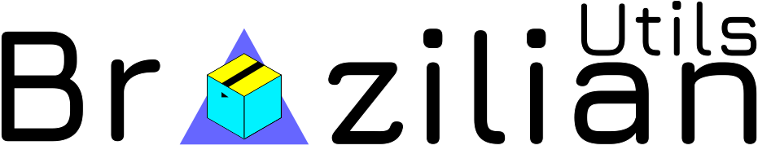

[![Version][version-shield]][version-url]
[![Forks][forks-shield]][forks-url]
[![Stargazers][stars-shield]][stars-url]
[![Issues][issues-shield]][issues-url]
[![MIT License][license-shield]][license-url]
[![Downloads][download-url]][download-url]


<!-- PROJECT LOGO -->
<br />
<p align="center">
  <a href="https://github.com/giovannifersan/brazilianutils">
    
  </a>

  <h3 align="center">Util Tools for developers in Brazil</h3>

  <p align="center">
    A full set of tools for generating slips, tax calculations, business data, among others, check out ...
    <br />
    <a href="https://github.com/giovannifersan/brazilianutils"><strong>Explore the docs »</strong></a>
    <br />
    <br />
    ·
    <a href="https://github.com/giovannifersan/brazilianutils/issues">Report Bug</a>
    ·
    <a href="https://github.com/giovannifersan/brazilianutils/issues">Request Feature</a>
    ·
  </p>
</p>


<!-- SUMMARY -->
<details open="open">
  <summary>Summary</summary>
  <ol>
    <li>
      <a href="#about-the-project">About The Project</a>
      <ul>
        <li><a href="#built-with">Built With</a></li>
      </ul>
    </li>
    <li>
      <a href="#getting-started">Getting Started</a>
      <ul>
        <li><a href="#prerequisites">Prerequisites</a></li>
        <li><a href="#installation">Installation in project</a></li>
        <li><a href="#installation-local">Installation local</a></li>
      </ul>
    </li>
    <li><a href="#usage">Usage</a></li>
    <li><a href="#roadmap">Roadmap</a></li>
    <li><a href="#contributing">Contributing</a></li>
    <li><a href="#license">License</a></li>
    <li><a href="#contact">Contact</a></li>
  </ol>
</details>


<!-- ABOUT THE PROJECT -->
## About The Project

There are many great Brazilian Tools templates available on GitHub, however, I didn't find one that really suit my needs so I created this enhanced one. I want to create a Brazilian Tool so amazing that it'll be the last one you ever need -- I think this is it.

Here's why:
* Your time should be focused on creating something amazing. A project that solves a problem and helps others
* You shouldn't be doing the same tasks over and over like creating a invoice from scratch
* You should element DRY principles to the rest of your life :smile:

Of course, no one template will serve all projects since your needs may be different. So I'll be adding more in the near future. You may also suggest changes by forking this repo and creating a pull request or opening an issue. Thanks to all the people have have contributed to expanding this!


### Built With


* JavaScript
* TypeScript
* ESlint


<!-- GETTING STARTED -->
## Getting Started

This is an example of how you may give instructions on setting up your project locally.
To get a local copy up and running follow these simple example steps.

### Prerequisites

This is an example of how to list things you need to use the software and how to install them.

### Installation in usage project
* yarn
    ```sh
    yarn add brazilianutils
    ```
* npm
  ```sh
  npm install brazilianutils
  ```

### Installation of package to local test

1. Clone the repo
   ```sh
   git clone https://github.com/giovannifersan/brazilianutils.git
   ```
2. Installing packages
   ```sh
   yarn || npm install
   ```
3. Run the tests
   ```sh
   yarn test || npm run test
   ```


<!-- ROADMAP -->
## Roadmap

See the [open issues](https://github.com/giovannifersan/brazilianutils/issues) for a list of proposed features (and known issues).


<!-- CONTRIBUTING -->
## Contributing

Contributions are what make the open source community such an amazing place to be learn, inspire, and create. Any contributions you make are **greatly appreciated**.

1. Fork the Project
2. Create your Feature Branch (`git checkout -b feature/AmazingFeature`)
3. Commit your Changes (`git commit -m 'Add some AmazingFeature'`)
4. Push to the Branch (`git push origin feature/AmazingFeature`)
5. Open a Pull Request


<!-- LICENSE -->
## License

Distributed under the MIT License. See `LICENSE` for more information.


<!-- CONTACT -->
## Contact

Giovanni Fersan - [@giovannifersan](https://twitter.com/giovannifersan) - Twitter

Project Link: [https://github.com/giovannifersan/brazilianutils](https://github.com/giovannifersan/brazilianutils)


<!-- MARKDOWN LINKS & IMAGES -->
<!-- https://www.markdownguide.org/basic-syntax/#reference-style-links -->
[version-shield]: https://img.shields.io/github/package-json/v/giovannifersan/brazilianutils?style=for-the-badge
[version-url]: https://github.com/giovannifersan/brazilianutils/graphs/contributors
[forks-shield]: https://img.shields.io/github/forks/giovannifersan/brazilianutils.svg?style=for-the-badge
[forks-url]: https://github.com/giovannifersan/brazilianutils/network/members
[stars-shield]: https://img.shields.io/github/stars/giovannifersan/brazilianutils.svg?style=for-the-badge
[stars-url]: https://github.com/giovannifersan/brazilianutils/stargazers
[issues-shield]: https://img.shields.io/github/issues/giovannifersan/brazilianutils.svg?style=for-the-badge
[issues-url]: https://github.com/giovannifersan/brazilianutils/issues
[license-shield]: https://img.shields.io/github/license/giovannifersan/brazilianutils.svg?style=for-the-badge
[license-url]: https://github.com/giovannifersan/brazilianutils/blob/master/LICENSE.txt
[download-url]: https://img.shields.io/github/downloads/giovannifersan/brazilianutils/total?style=for-the-badge
